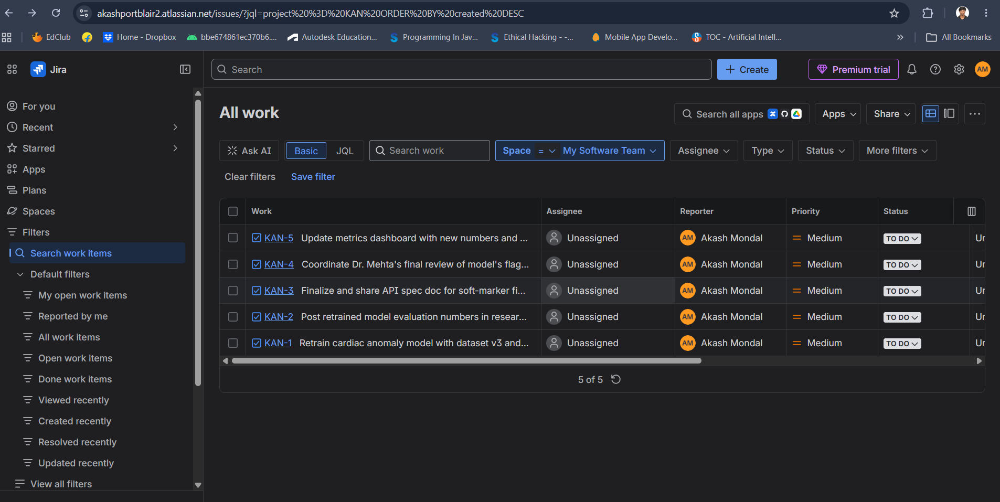
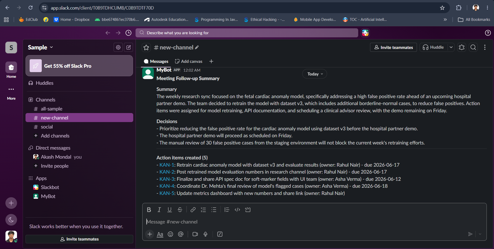

# Write-up: Meeting Notes -> Jira -> Slack Automation

## Approach

The pipeline is a small Python CLI (`automation/main.py`) with three stages:

1. **Extraction** (`extract_action_items.py`) - the raw transcript is sent to Gemini
   (Google Gemini API) with `response_mime_type="application/json"` and a strict
   JSON `response_schema`. This guarantees structured output (no parsing free-form text) and
   produces:
   - a short meeting summary
   - a list of decisions
   - a list of action items, each with `title`, `description`, `owner`, `due_date`,
     `priority`, and a `source_quote` for auditability.

2. **Jira ticket creation** (`jira_client.py`) - for each action item, a Task is
   created via the Jira Cloud REST API v3 (`POST /rest/api/3/issue`). The ticket
   description includes the source quote so anyone reviewing it can trace the ticket
   back to what was actually said.

3. **Slack summary** (`slack_client.py`) - once all tickets are (attempted to be)
   created, a single Block Kit message is posted to a Slack channel via
   `chat.postMessage`, summarizing the meeting, decisions, and linking each created
   Jira ticket. Any tickets that failed to create are listed separately so nothing
   silently disappears.

The intermediate extraction is also written to `output/action_items.json` so the
extraction step can be inspected/audited independently of Jira/Slack.

## Key decisions and reasoning

- **Schema-constrained JSON output for extraction, not free-form prompting.** Asking
  the model to return structured JSON via a `response_schema` (rather than parsing
  text) eliminates a whole class of "the model wrapped its answer in a sentence"
  parsing failures, and makes the contract between extraction and downstream steps
  explicit and testable.

- **Conservative extraction rules.** The system prompt explicitly tells the model not
  to invent action items from general discussion, and to leave `owner`/`due_date` as
  `null` rather than guess. The challenge calls out that action items are "frequently
  missed, assigned to the wrong person" today - a wrong assignment is worse than no
  assignment, since a wrongly-assigned ticket can sit ignored in someone's queue.

- **Owner resolution is best-effort and fails safe.** `JiraClient.find_account_id`
  looks up a Jira user by name/email via `/rest/api/3/user/search`. It only assigns the
  ticket if there is exactly one match; otherwise the ticket is left unassigned and the
  suggested owner name is written into the description so a human triages it. This
  avoids silently assigning the wrong "Rahul" in a workspace with two Rahuls.

- **`source_quote` on every action item.** Every ticket's description includes the
  exact transcript text it was derived from. This is the main defense against
  hallucinated or misinterpreted action items - a reviewer can immediately check the
  ticket against what was actually said.

- **Priority surfaced as a label, not the native Jira `priority` field.** Team-managed
  Jira projects don't always expose the `priority` field on the create-issue screen,
  and sending a field that isn't on the screen makes the whole `POST` fail. Encoding
  priority as a label (`priority-high`, etc.) is robust across project configurations
  and still filterable/visible in Jira.

- **Per-item failure isolation.** If creating one Jira ticket fails (bad field,
  network error, etc.), the loop continues with the remaining items rather than
  aborting the whole run. Failures are collected and surfaced in the Slack message
  under "Failed to create" so they're visible rather than silently dropped.

- **Slack post happens once, after all Jira attempts.** This keeps the Slack message a
  single coherent summary (with real Jira links) rather than N separate messages, which
  matches the "structured, readable summary" requirement and avoids channel spam.

- **Dry-run mode.** `--dry-run` runs only the extraction step and prints/saves the
  result. This lets you validate that the model is correctly identifying action items
  before spending Jira/Slack API calls, and is what I used to iterate on the prompt.

## Assumptions

- The transcript is plain text (works equally well with a polished transcript or rough
  typed notes - the extraction prompt doesn't assume speaker labels, though they help).
- One Jira project and one Slack channel per run - multi-team routing (e.g. different
  Jira projects per topic) is out of scope for this version.
- "Action item" means a concrete commitment by a person or the team, not every topic
  discussed - this is enforced via the extraction prompt rather than post-filtering.
- The meeting date is supplied as a CLI argument (defaults to today) so relative dates
  ("by Friday") can be resolved to absolute dates for Jira's `duedate` field.
- Jira user search (`/rest/api/3/user/search`) is available to the API token's account
  - on some restricted Jira configurations this endpoint requires admin permissions; if
  it's unavailable, the code already degrades gracefully (treats it as "no match" and
  leaves the ticket unassigned).

## Failure scenarios considered

| Scenario | Behavior |
|---|---|
| Gemini returns zero action items | Slack message says so explicitly; no Jira calls made |
| Owner name doesn't match a Jira user (or matches >1) | Ticket created unassigned, name noted in description |
| Due date can't be resolved to ISO date | Ticket created without `duedate`, original phrasing kept in description |
| One Jira ticket creation fails (e.g. bad project key) | Other tickets still created; failure listed in Slack message and process exits non-zero |
| Slack post fails (e.g. bad token/channel) | Tickets are still created (not lost); error printed and process exits non-zero so it's visible in CI/logs |
| Transcript file missing/empty | CLI exits early with a clear error before calling any API |

## What I'd improve given more time

- **Idempotency / re-run safety**: currently re-running on the same transcript creates
  duplicate Jira tickets. I'd store a hash of each action item (or the transcript) and
  check existing tickets (e.g. via JQL search on a custom field) before creating new
  ones.
- **Speaker-aware owner resolution**: if the transcript has speaker labels and a
  roster mapping speaker names to Jira account IDs / Slack user IDs, owner assignment
  and Slack `@mentions` could be much more reliable than free-text name matching.
- **Slack `@mentions`** for assignees (requires the roster above) so people get
  notified directly, not just named in text.
- **Automated trigger**: instead of a manual CLI run, hook this up to whatever produces
  the transcript (e.g. a meeting-recording tool's webhook, or a watched folder/Drive
  integration) so it runs automatically after each meeting.
- **Human-in-the-loop confirmation step**: for higher-stakes meetings, post the
  extracted action items to Slack *first* for a thumbs-up/thumbs-down before creating
  Jira tickets, rather than creating tickets immediately.
- **Tests**: unit tests for `jira_client`/`slack_client` against mocked HTTP responses,
  and a small fixture-based test for the extraction prompt's behavior on edge cases
  (no action items, ambiguous owners, multiple due dates).
- **Better due-date handling**: support fuzzy timeframes ("next sprint") by looking up
  the team's actual sprint calendar via the Jira Agile API instead of leaving them
  unset.

## Submission artifacts

- Transcript: `transcripts/meeting_transcript.txt` (real meeting) /
  `transcripts/sample_meeting_transcript.txt` (used for development/testing)
- Code: `automation/`
- Jira tickets: KAN-1 through KAN-5, created by a live run of `automation/main.py` on
  `sample_meeting_transcript.txt`.
  
- Slack message: posted to the configured channel by the same run
  ([permalink](https://sample-kl58163.slack.com/archives/C0B9TDTF70D/p1781202740267389)).
  
